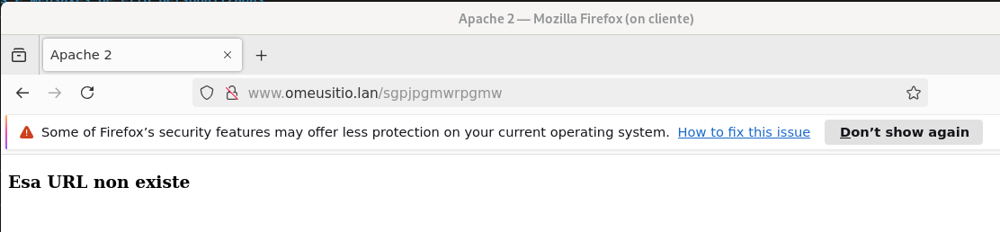

# Tarefa 5. Logs e Mensaxes de erro personalizadas
### Tomando como punto de partida a tarefa anterior

- Queremos facer un log de acceso no ficheiro /var/log/apache2/omeusitio.lan /acceso.log. Nese log queremos gardar:
  - Enderezo IP do cliente
  - Hora na que foi recibida a petición
  - Bytes recibidos (tamaño da petición)
  - Tamaño da resposta
  - Tempo que se tardou en servir a petición
  - Estado de resolución da petición (código de resposta)
  - Usuario remoto se foi autenticado
  - Primeira liña da request
  - Navegador do usuario

- No caso de que non exista un recurso no servidor, queremos facer que se cargue o documento nonexiste.html. Indica a configuración establecida e inclúe unha captura do navegador accedendo a unha URL que non existe.

- No caso de que o acceso a un recurso estea prohibido, indica que configuración establecerías para amosar directamente a mensaxe de erro “Acceso prohibido a este recurso” e tamén unha captura do navegador amosando este erro.

- Indica como farías para que se fixese un log dos erros no ficheiro /var log/apache2/omeusitio.lan/erros.log co seguinte formato:
  - Enderezo IP do cliente
  - Hora na que se produce o erro
  - Nivel de log
  - Código de estado de erro
  - Nome do módulo que produce o erro
  - Mensaxe de Erro

