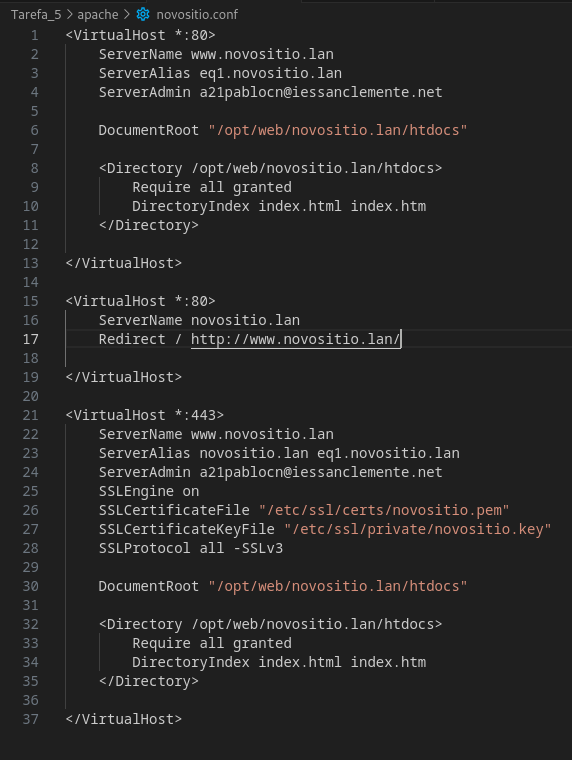

# Tarefa 6. Redireccións
### Tomando como punto de partida a tarefa anterior, queremos facer as seguintes redireccións:

- Cando se accede a http://novositio.lan se acceda a http://www.novositio.lan. 
O usuario do navegador web debe ver a URL nova. Indica a configuración do novo sitio virtual que se creou.
    

- Cando o cliente introduza ao ficheiro /un.html se redireccione ao ficheiro index.html vendo o usuario a URL nova. 

- Cando se accede ao  sitio http debe redirixirse ao mesmo sitio https.

