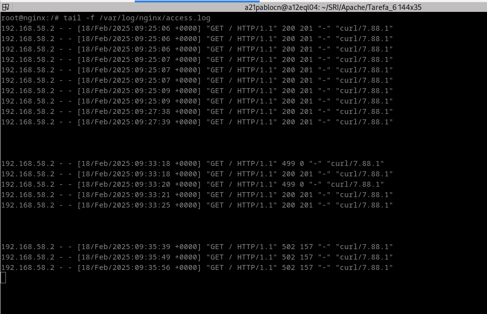

# Tarefa 7. Servidores Web e Proxies Inversos
### Necesitarás tamén un servidor DNS con dnsmasq para que os clientes accedan ao servidor web. O rexistro DNS deberá apuntar sempre ao equipo "frontend". O nome do dominio, pode ser "sitio.lan" ou calquera invetado por ti

### Para cada un dos seguintes supostos, deberás entregar:

- Captura da configuración de todos os host virtuais e/ou servidores web/balanceadores

- Vídeo onde o cliente acceda á paxina inicial (podes facelo con curl) e recargue varias veces, onde se vexa tamén o log dos accesos ao servidor web frontend e os dous servidores web Apache de backend balanceados. Deberás apagar un servidor, apagar o outro, apagar os dous e volver a encender os dous para ver o que sae nos logs. (Non fai falla que subas o vídeo a Youtube. Con que o poñas no teu drive e o compartas comigo, é suficiente.)
Balanceador con NGinx

Logs apaches apagando 1:

Logs nginx apagando 1:

Logs nginx apagando os 2:

Logs apaches encendendo os 2:

Logs nginx encendendo os 2:

1. Deberás ter instalados os paquetes libapache2-mod-php php

Código do ficheiro index.php

    <html>
    <head>
        <title><?php echo "Sitio Web #1 en ${_SERVER['SERVER_ADDR']}"?></title>
    </head>
    <body>
    <h1>Sitio Web #1</h1>

    <?php echo "Est&aacute;s en ${_SERVER['SERVER_ADDR']}" ?>
     
    <?php echo "Enderezo IP do cliente ${_SERVER['REMOTE_ADDR']}"?>
    </body>
    </html>